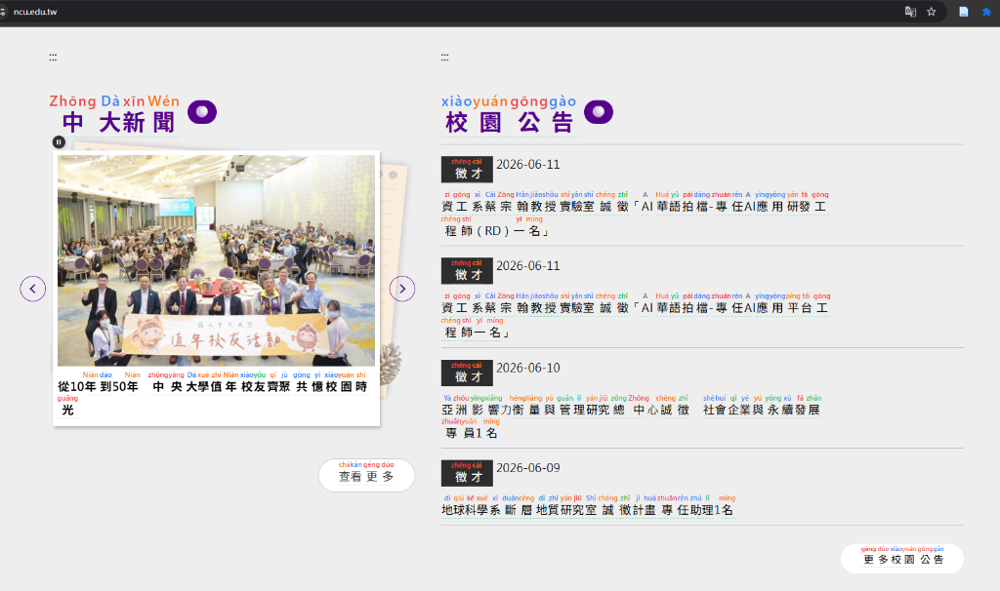
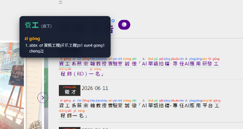
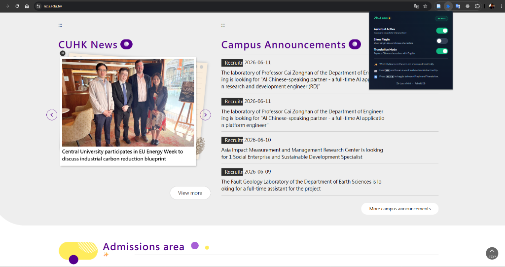

# Zh-Lens 🔍

Zh-Lens is a high-performance, production-ready Chrome Extension (Manifest V3) designed to assist users in reading, segmenting, and translating Chinese characters directly on any webpage. By wrapping Chinese text in interactive **Duolingo-style `<ruby>` structures** and querying a locally-stored CC-CEDICT dictionary via a background worker and IndexedDB, it delivers a smooth, native-feeling reading experience at 60 FPS.

## 📸 Screenshots

### 1. Pinyin Annotation


### 2. Dictionary Popup (Hold Alt)


### 3. Sentence Translation (Alt + Q)


> Sentence translation uses Chrome's on-device **[Translator API](https://developer.chrome.com/docs/ai/translator-api)** (Chrome 138+ desktop) for fully local, official translation. On builds where the API is unavailable, it automatically falls back to the legacy gtx endpoint.

---

## ✨ Features

- **Automated Text Scan & Segmentation:** Automatically detects Chinese character ranges (`[\u4e00-\u9fa5]`) and restructures continuous text nodes into segmented words.
- **Duolingo-Style Annotation:** Places tone-marked Pinyin directly above segmented Chinese words using standard HTML `<ruby>` formatting.
- **Interactive Translation Tooltips:** Hover over any annotated word block while holding the modifier key to view a dark-themed tooltip showing simplified/traditional variants, tone-marked Pinyin, and English definitions.
- **Dashed Boundaries:** Displays subtle, non-intrusive dashed underlines below grouped word segments to clearly indicate word boundaries.
- **Zero-Block Database Engine:** Parses the large CC-CEDICT database on installation and stores it in browser-native **IndexedDB**. Lookups are performed asynchronously via the background Service Worker, preventing any main-thread blocking.
- **Dynamic Configuration & Popup:** Toggle annotation modes, Pinyin rendering, and translation features dynamically through a sleek extension dashboard popup.

---

## 🎹 Interaction & Hotkeys

- **`Alt` (Windows/Linux) / `Option` (macOS):** Hold this modifier key and hover over annotated Chinese words to instantly reveal the translation tooltip.
- **`Alt + Q`:** Quick-toggle between **Pinyin mode** (which renders Pinyin text above characters) and **Translation mode** (which displays full sentence/word structure underlines and hides Pinyin layout).

---

## 🛠️ Folder Structure

```text
zh-lens/
├── manifest.json         # Extension Manifest V3 configuration
├── background.js         # Service Worker (IndexedDB storage & query listener)
├── content.js            # Content script (DOM walker, event listeners, & segmentation)
├── styles.css            # Extension layout CSS (ruby styling, tooltips, transitions)
├── download_dict.ps1     # Automation script to fetch CC-CEDICT database (Windows)
├── download_dict.sh      # Automation script to fetch CC-CEDICT database (Linux/macOS)
├── package.ps1           # Build & packaging script for Web Store (Windows)
├── package.sh            # Build & packaging script for Web Store (Linux/macOS)
├── .gitignore            # Git exclusions
├── README.md             # Project documentation
├── dictionary/
│   └── cedict.txt        # Parsed CC-CEDICT dictionary file (Git ignored, generated)
├── popup/
│   ├── popup.html        # Dashboard popup layout
│   ├── popup.css         # Dashboard popup styling
│   └── popup.js          # Dashboard popup controllers & polling
└── icons/
    ├── icon16.png        # Extension toolbar icons
    ├── icon48.png
    └── icon128.png
```

---

## 🚀 Setup & Installation

> **Just want to use it?** Follow **Option A** to install a pre-built release.
> **Want to develop or build from source?** Skip to **Option B**.

---

### Option A: Install from a Release (Recommended)

Zh-Lens is currently in **beta** and not yet on the Chrome Web Store, so you install it manually from a packaged release. The release archive already bundles the CC-CEDICT dictionary — no separate download needed.

1. Go to the [**Releases**](https://github.com/robbyarif/zh-lens/releases) page and download the `zh-lens-vX.Y.Z.zip` asset from the latest release.
2. **Unzip** the archive into a folder you'll keep (Chrome loads the extension from this folder, so don't delete it afterward).
3. Open Google Chrome and navigate to `chrome://extensions/`.
4. Enable **Developer mode** using the toggle switch in the top-right corner.
5. Click **Load unpacked** in the top-left corner.
6. Select the **unzipped folder** (the directory containing `manifest.json`).
7. The extension will initialize and seed the dictionary into IndexedDB. Click the extension icon to view the seeding progress bar.

> **Updating:** When a new release is published, download and unzip the new version over the same folder (or into a fresh one), then click the refresh ↻ icon on the Zh-Lens card in `chrome://extensions/`.

---

### Option B: Build from Source (Developers)

#### 1. Setup the Dictionary
Because the CC-CEDICT dictionary data is large (approx. 10MB), it is not checked into version control. You must download and prepare it first.

**On Windows:**
```powershell
.\download_dict.ps1
```

**On Linux/macOS:**
```bash
./download_dict.sh
```

This script will:
- Download the official UTF-8 CC-CEDICT zip archive.
- Extract the files into the `dictionary/` directory.
- Rename the extracted dictionary file to `cedict.txt`.

#### 2. Install in Google Chrome
1. Open Google Chrome and navigate to `chrome://extensions/`.
2. Enable **Developer mode** using the toggle switch in the top-right corner.
3. Click **Load unpacked** in the top-left corner.
4. Select the `zh-lens` project folder (the directory containing `manifest.json`).
5. The extension will initialize and seed the dictionary into IndexedDB. You can click the extension icon to view the database seeding progress bar.

---

## 📦 Packaging for Production

To package the extension into a Chrome Web Store-compliant deployment archive, run the build script:

**On Windows:**
```powershell
.\package.ps1
```

**On Linux/macOS:**
```bash
./package.sh
```

This script cleans up workspace artifacts, creates a clean staging folder containing only runtime files, compresses the assets, and generates a production-ready package at:
`zh-lens-production.zip`
